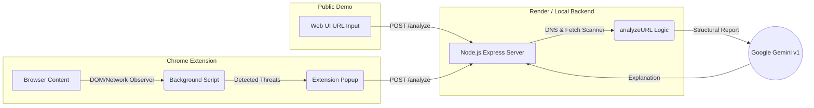

# 🛡️ SHIELD — Real-Time Browser Threat Detection

[](LICENSE)
[](https://developer.chrome.com/)
[](https://ai.google.dev/)

> Real-time detection of suspicious browser behavior with AI-assisted explanations, backed by an active URL structure analyzer.

---

## 🚧 Project Status

This project is currently in the **prototype stage** for the  
**Google Solution Challenge 2026 (Build with AI)**.

- Core detection (network + DOM) implemented  
- Real-time monitoring functional  
- Gemini AI integration working  
- Under active development  

---

## 🚀 Live Demo (Web Simulator)

Experience SHIELD's threat detection via our interactive web simulator:
👉 **[View Live Demo](https://mveekshan1.github.io/Sheild-extension/)**

> **Note:** The web demo features an interactive **URL Risk Analyzer** that uses our real backend to dynamically fetch, parse DNS records, and inspect structural vectors of any URL. It showcases our active threat assessment capabilities without requiring Chrome installation!

### How to use the Interactive Web Demo

1. Enter a valid URL in the Web Demo input field (e.g., `https://google.com`).
2. The SHIELD Node.js Backend fetches the remote page securely, checks DNS validity, and analyzes structural threats (redirects, intense script counts, insecure HTTP).
3. The Backend assigns a cumulative risk score and forwards the structural report to the Gemini AI Engine to produce an explanation.

**Test Cases to Try:**
- *Low Risk*: `https://google.com` (Secure, legitimate domain).
- *High Risk*: `http://192.168.1.1/login` (Insecure, IP-based, suspicious keyword).

### Web Demo vs. Browser Extension
- **Web Demo**: Performs a point-in-time structural analysis of a given URL. It evaluates static features, DNS validity, and raw HTML payloads.
- **Browser Extension**: Monitors real-time, behavioral threats dynamically as you traverse the web (via `chrome.webRequest` and `MutationObserver`). The extension catches invisible DOM injections and sneaky network requests that static URL scanning cannot see.

---

## 🎯 Problem

Browser extensions operate with high permissions, but users:

- have no visibility into extension behavior  
- cannot detect suspicious activity in real time  

---

## 💡 Solution

SHIELD is a Chrome extension that:

- monitors browser behavior in real time  
- detects suspicious network requests and DOM injections  
- assigns a risk score  
- uses Google Gemini AI to explain threats  

---

## ⚙️ Features

- Network monitoring (`chrome.webRequest` in Extension)  
- DOM tracking (`MutationObserver` in Extension)  
- Interactive URL structural and DNS Risk Scoring (Web Demo + Backend)
- Gemini AI context-aware explanations  
- Cumulative Risk Metrics  

---



---

## 📦 Installation

git clone https://github.com/mveekshan1/Sheild-extension.git

Open chrome://extensions → Enable Developer Mode → Load Unpacked

---

## 🔑 Backend API Setup & Deployment

SHIELD's backend keeps the `GEMINI_API_KEY` hidden from the frontend.

### Option A: Local Development

1. Navigate to the backend directory:
   ```bash
   cd backend
   ```
2. Install dependencies (requires Node.js v18+):
   ```bash
   npm install
   ```
3. Set your environment variables (create a `.env` file):
   ```ini
   PORT=3000
   GEMINI_API_KEY=your_gemini_api_key_here
   ```
4. Run the Express server:
   ```bash
   npm start
   ```

### Option B: Cloud Deployment (Production)

To host the backend API for external access (such as for the GitHub Pages web demo), use **Render** or **Google Cloud Run**.

#### Deploying on Render (Free & Fast)
1. Commit the code to GitHub.
2. Sign up at [Render.com](https://render.com) and click **New > Web Service**.
3. Connect your repository.
4. Settings:
   - Base Directory: `backend`
   - Runtime: `Node`
   - Build Command: `npm install`
   - Start Command: `npm start`
5. Click **Advanced > Environment Variables** and add:
   - `GEMINI_API_KEY`: <your_gemini_api_key>
6. Click **Deploy Web Service** and copy your secure `https://<app>.onrender.com` URL. Ensure you update `docs/script.js` with this URL!

#### Deploying on Google Cloud Run (Scalable)
1. Install the `gcloud` CLI.
2. Navigate to the `backend` folder via terminal.
3. Execute the deployment command:
   ```bash
   gcloud run deploy shield-backend --source . --region us-central1 --allow-unauthenticated --set-env-vars GEMINI_API_KEY=your_gemini_api_key
   ```
4. Copy the generated `https://...run.app` service URL.

*(Note: The frontend Extension will still use `localhost:3000` by default unless configured otherwise).*

---

## ⚠️ Limitations

- **Extension Limits**: Cannot access internal logic of other extensions. Detection relies entirely on observable DOM/Network behavior.
- **Web Demo Limits**: The web demo analyzes the URL structure, DNS validation, and immediate HTML document response. It *cannot* perform full behavioral analysis (like tracing asynchronous JavaScript malware injections or monitoring active web requests) because it lacks the physical presence of a browser extension.

---

## 🛠️ Tech Stack

- Chrome Extension  
- JavaScript  
- Google Gemini API  

---

## 🤝 Contributing

See CONTRIBUTING.md

---

## 📄 License

MIT License

---

## 👨‍💻 Team

- **mveekshan1** - Team Leader, System Design & Development ([GitHub](https://github.com/mveekshan1))
- **sakshi-kumari28** - AI Developer, Gemini Integration & Threat Analysis ([GitHub](https://github.com/sakshi-kumari28))
