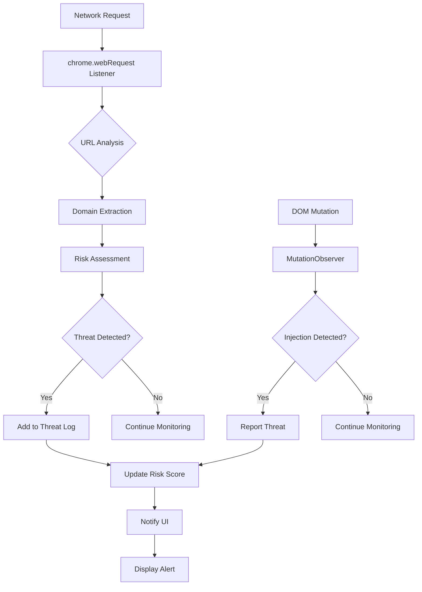
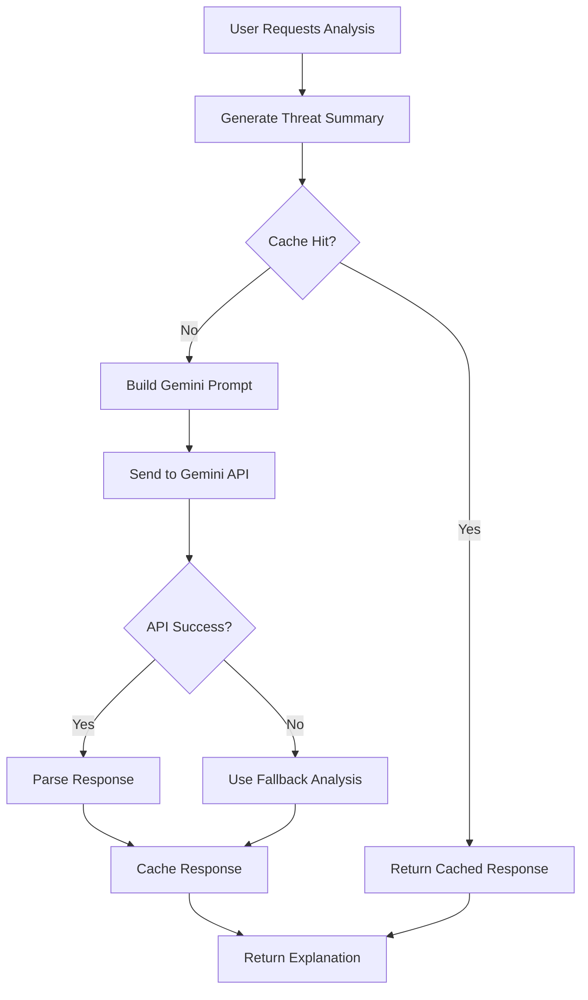

# 🏗️ SHIELD Architecture Overview

## Table of Contents

- [System Architecture](#system-architecture)
- [Component Breakdown](#component-breakdown)
- [Data Flow](#data-flow)
- [Security Considerations](#security-considerations)
- [Performance Characteristics](#performance-characteristics)
- [Extension Architecture Patterns](#extension-architecture-patterns)

## System Architecture

SHIELD follows a modular, event-driven architecture designed for Chrome Extension Manifest V3. The system is composed of four main layers:

```
┌─────────────────────────────────────────────────────────────┐
│                    🎨 USER INTERFACE                        │
│  ┌─────────────────┐  ┌─────────────────┐  ┌─────────────┐  │
│  │   Popup UI      │  │  Risk Display   │  │  Controls   │  │
│  └─────────────────┘  └─────────────────┘  └─────────────┘  │
└─────────────────────────────────────────────────────────────┘
                                 │
┌─────────────────────────────────────────────────────────────┐
│                 🤖 AI SERVICE LAYER                         │
│  ┌─────────────────┐  ┌─────────────────┐  ┌─────────────┐  │
│  │ Gemini API      │  │ Response Cache  │  │  Fallbacks  │  │
│  └─────────────────┘  └─────────────────┘  └─────────────┘  │
└─────────────────────────────────────────────────────────────┘
                                 │
┌─────────────────────────────────────────────────────────────┐
│                 🔍 DETECTION ENGINE                         │
│  ┌─────────────────┐  ┌─────────────────┐  ┌─────────────┐  │
│  │ Content Scripts │  │ Risk Scoring    │  │  Analysis  │  │
│  └─────────────────┘  └─────────────────┘  └─────────────┘  │
└─────────────────────────────────────────────────────────────┘
                                 │
┌─────────────────────────────────────────────────────────────┐
│              🎯 BACKGROUND SERVICE WORKER                   │
│  ┌─────────────────┐  ┌─────────────────┐  ┌─────────────┐  │
│  │ Web Request     │  │ State Mgmt      │  │  Messaging  │  │
│  │ Monitoring      │  │                 │  │             │  │
│  └─────────────────┘  └─────────────────┘  └─────────────┘  │
└─────────────────────────────────────────────────────────────┘
```

## Component Breakdown

### 1. Background Service Worker (`src/background/background.js`)

**Responsibilities:**
- **Network Monitoring**: Intercepts all network requests using `chrome.webRequest` API
- **State Management**: Maintains global threat state and risk scores
- **Message Routing**: Handles communication between all extension components
- **Lifecycle Management**: Manages extension startup, cleanup, and periodic tasks

**Key Features:**
- Event-driven architecture using Chrome extension messaging
- Memory-efficient threat logging with automatic cleanup
- Configurable risk thresholds and scoring rules
- Periodic data maintenance to prevent memory leaks

### 2. Content Scripts (`src/content/contentScript.js`)

**Responsibilities:**
- **DOM Monitoring**: Observes DOM mutations for malicious injections
- **Network Interception**: Provides fallback network monitoring
- **Page Context Access**: Operates within the security context of web pages

**Key Features:**
- MutationObserver-based DOM change detection
- Non-blocking network request monitoring
- Graceful degradation when background monitoring fails
- Minimal performance impact on page loading

### 3. AI Service Layer (`src/services/gemini.js`)

**Responsibilities:**
- **API Integration**: Manages communication with Google Gemini AI
- **Response Caching**: Optimizes API usage and improves performance
- **Error Handling**: Provides fallbacks when AI analysis is unavailable

**Key Features:**
- Intelligent caching with TTL-based expiration
- Request timeout handling and retry logic
- Graceful degradation to rule-based analysis
- Configurable AI model parameters

### 4. User Interface (`src/popup/`)

**Responsibilities:**
- **Real-time Display**: Shows current threat status and risk scores
- **User Controls**: Provides interface for threat analysis and mitigation
- **Status Updates**: Reflects system state changes immediately

**Key Features:**
- Reactive UI updates based on background state changes
- Color-coded risk visualization
- Progressive disclosure of threat details
- Accessible design with keyboard navigation

## Data Flow

### Threat Detection Flow



### AI Analysis Flow



### Message Passing Architecture

SHIELD uses Chrome's extension messaging system for inter-component communication:

```javascript
// Background ↔ Content Script
chrome.runtime.sendMessage({
  type: 'DOM_THREAT',
  details: threatData
});

// Background ↔ Popup
chrome.runtime.sendMessage({
  type: 'THREAT_DETECTED',
  threat: threatObject
});
```

## Security Considerations

### Data Privacy
- **Minimal Data Collection**: Only threat metadata is stored temporarily
- **No Personal Information**: User browsing history is not logged
- **Local Processing**: All analysis occurs client-side
- **API Data**: Only threat summaries sent to Gemini (no URLs or content)

### API Security
- **Key Management**: API keys stored securely (not in source code)
- **Request Limiting**: Built-in rate limiting and caching
- **Error Handling**: Graceful degradation when API unavailable
- **HTTPS Only**: All external communications use secure protocols

### Extension Security
- **Permission Justification**: Minimal required permissions for functionality
- **Content Security Policy**: Restricts resource loading and script execution
- **Input Validation**: All user inputs and API responses validated
- **Secure Defaults**: Conservative defaults that prioritize security

## Performance Characteristics

### Memory Management
- **Threat Log Limits**: Maximum 100 entries with automatic cleanup
- **Cache Size Control**: Gemini responses limited to 50 entries
- **Periodic Cleanup**: Automatic removal of stale data every 60 seconds
- **Efficient Data Structures**: Optimized for fast lookups and minimal memory usage

### CPU Usage
- **Event-Driven Processing**: No continuous polling or busy-waiting
- **Debounced Updates**: UI updates batched to prevent excessive re-rendering
- **Background Processing**: Heavy analysis moved to service worker
- **Lazy Loading**: Components loaded only when needed

### Network Efficiency
- **Request Batching**: Multiple threat analysis requests combined
- **Intelligent Caching**: API responses cached for 5 minutes
- **Compression**: Response data compressed where possible
- **Timeout Handling**: Prevents hanging requests from blocking UI

## Extension Architecture Patterns

### Manifest V3 Compliance
SHIELD follows Chrome Extension Manifest V3 best practices:

- **Service Workers**: Background processing in service worker context
- **Declarative APIs**: Uses `chrome.webRequest` for network monitoring
- **Promise-Based APIs**: Modern asynchronous programming patterns
- **Security Enhancements**: Improved CSP and permission controls

### Modular Design Principles
- **Separation of Concerns**: Each component has a single responsibility
- **Dependency Injection**: Loose coupling between modules
- **Configuration-Driven**: Behavior controlled by configuration objects
- **Error Boundaries**: Isolated error handling prevents system-wide failures

### Scalability Considerations
- **Event-Driven Scaling**: System can handle increased load through events
- **Configurable Limits**: Adjustable thresholds for different use cases
- **Progressive Enhancement**: Core functionality works without AI features
- **Extension Points**: Architecture supports future feature additions

## Deployment Architecture

### Development Environment
```
src/
├── background/
├── content/
├── popup/
└── services/

public/
└── manifest.json

docs/
└── *.md
```

### Production Build
```
dist/
├── background.js (bundled)
├── content.js (bundled)
├── popup.html
├── popup.js (bundled)
├── manifest.json
└── assets/
```

### Chrome Web Store Package
- **ZIP Archive**: All files compressed for store submission
- **Version Management**: Semantic versioning for updates
- **Update Channels**: Beta and stable release channels
- **Automated Testing**: CI/CD pipeline for quality assurance

This architecture ensures SHIELD remains maintainable, performant, and secure while providing a solid foundation for future enhancements.